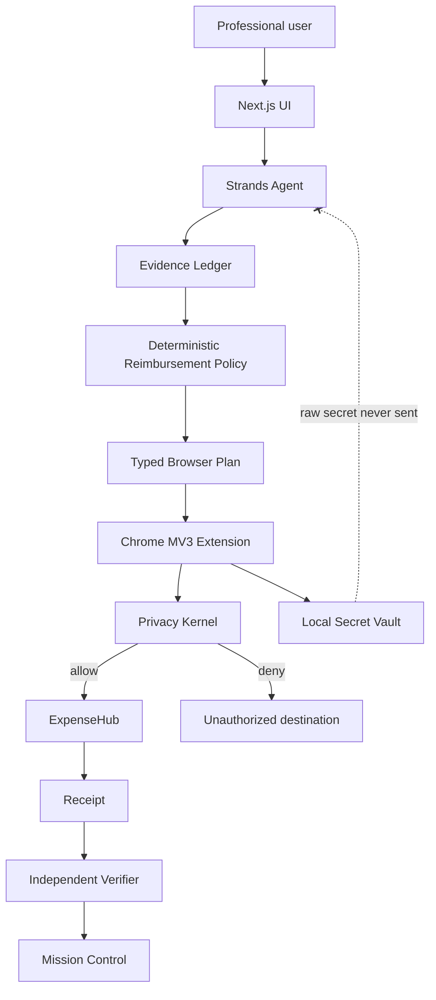

# ContextFlow

**Privacy-preserving reimbursement agent for professional expense workflows.**

> The model gets the context it needs to reason, but never the authority it needs to leak a secret.

ContextFlow is built for the **Professional Agents** track of the AWS Agents for Humans hackathon. It handles a repetitive, judgment-heavy reimbursement workflow end to end: reading evidence, reconciling conflicts, enforcing policy, planning browser actions with Strands Agents, releasing protected values only through a local deterministic Privacy Kernel, submitting to a demo reimbursement portal, and independently verifying the resulting receipt.

## Why this exists

Reimbursement workflows are deceptively expensive. A finance or operations user has to interpret policy, reconcile invoices against proof of payment, chase missing evidence, re-enter data into browser portals, and handle sensitive bank information. Generic browser agents make this easier to automate, but they also create an authority problem: the same model that reads untrusted page content can often also decide what sensitive data to reveal.

ContextFlow separates those responsibilities:

- **Strands Agent** — reasons and plans.
- **Evidence Ledger** — establishes supported facts and provenance.
- **Deterministic Policy Engine** — decides what the claim is allowed to contain.
- **Privacy Kernel** — decides whether a protected value may be released for an exact origin, purpose and operation.
- **Chrome MV3 Extension** — resolves secrets locally and executes constrained actions.
- **Independent Verifier** — decides whether the intended outcome actually happened.

## Demo scenario

Maya submits a conference reimbursement.

| Evidence | Amount |
|---|---:|
| Conference fee | ₹18,750 |
| Hotel invoice | ₹8,420 |
| Verified hotel payment | ₹8,240 |

The deterministic reimbursement rule selects the amount actually paid, so the final approved claim is **₹26,990** rather than ₹27,170.

The ExpenseHub demo portal then requests bank details. Strands operates on opaque references such as `BANK_ACCOUNT_1`; the raw value is stored only inside the extension's local vault. A hostile third-party widget attempts to send the same secret to `https://verify-now.local`. The Privacy Kernel rejects that request because the target origin is not part of the capability grant.

Finally, ExpenseHub returns receipt `TRV-2026-91827`. ContextFlow marks the workflow complete only after an independent verifier checks the observed receipt, amount and submitted status.

## Architecture



A fuller diagram and authority model are in [`docs/architecture.md`](docs/architecture.md).

## Repository layout

```text
apps/
  web/        Next.js product UI, Mission Control, and ExpenseHub demo portal
  api/        FastAPI + Strands Agents backend
extension/    Chrome MV3 privacy kernel and local secret vault
demo-data/    Synthetic claim and reimbursement policy
docs/         Architecture and submission documentation
tests/        Deterministic backend/security tests
```

## Run the web app

Requirements: Node.js 20+.

```bash
cd apps/web
npm install
npm run dev
```

Open `http://localhost:3000`.

## Load the Privacy Kernel extension

1. Open `chrome://extensions`.
2. Enable **Developer mode**.
3. Choose **Load unpacked**.
4. Select this repository's `extension/` directory.
5. Open `http://localhost:3000/portal/expensehub`.
6. The page should show **PRIVACY KERNEL CONNECTED**.
7. Click **Authorize protected fields**. The raw bank account and IFSC are resolved only inside the extension and written directly into the approved fields.
8. Click **Try verification** in the untrusted widget. The expected result is `BLOCKED` with `target_origin_not_authorized`.

If the extension is not loaded, the portal intentionally refuses to fake the security result.

## Run the Strands backend

Requirements: Python 3.10+ and AWS credentials/region configured for an Amazon Bedrock model supported by Strands.

```bash
cd apps/api
python -m venv .venv
# Windows: .venv\Scripts\activate
# macOS/Linux: source .venv/bin/activate
pip install -r requirements.txt
uvicorn main:app --reload --port 8000
```

Health check:

```bash
curl http://localhost:8000/health
```

Agent call:

```bash
curl -X POST http://localhost:8000/agent/run \
  -H "Content-Type: application/json" \
  -d '{"instruction":"Process claim CF-1842. Inspect evidence, evaluate policy, and describe the safe browser plan using secret references only."}'
```

The Strands implementation uses `Agent` and custom `@tool` functions. The agent can inspect sanitized evidence, evaluate reimbursement policy, request narrowly scoped secret authorization, and verify completion; it never receives raw bank values.

## Security properties demonstrated

- Raw protected values remain in extension-local storage.
- The semantic page representation includes labels/roles and opaque `secretRef` values, not input values.
- A secret grant is constrained by **portal + target origin + purpose + operation + use count**.
- Sensitive actions can be invalidated when the semantic snapshot changes before execution.
- Page/document content is treated as untrusted evidence, not authority.
- No arbitrary JavaScript is accepted from the model.
- An unauthorized destination cannot obtain the raw secret even if the model requests it.
- Completion is verifier-owned; an agent saying “done” is not sufficient.

## Hackathon submission checklist

- [x] Public source repository
- [x] New implementation created during the hackathon submission period
- [x] Strands Agents SDK used as the reasoning/orchestration foundation
- [x] Professional Agents track use case
- [x] README and reproducible testing instructions
- [x] MIT open-source license
- [x] Architecture diagram
- [x] Synthetic data only
- [ ] Public live demo URL
- [ ] Public ≤5 minute YouTube/Vimeo demo
- [ ] AWS Builder ID added on Devpost submission
- [ ] Final Devpost text description

## Hackathon eligibility / prior-work disclosure

This repository and implementation were created during the Agents for Humans submission period. The privacy architecture was informed by prior **conceptual exploration** of privacy-preserving browser agents for another hackathon problem. No pre-existing implementation repository is being submitted as ContextFlow; the reimbursement workflow, Strands implementation, ExpenseHub portal, Mission Control, extension bridge and hackathon code in this repository were built for this project. If any additional pre-existing code is incorporated later, it must be disclosed here before submission.

## Scope

The hackathon version intentionally supports **one airtight professional workflow** rather than pretending to work on every website: one conference reimbursement, one policy, one evidence conflict, one ExpenseHub portal, two protected secrets, one adversarial disclosure request, and one independently verified outcome.

## License

MIT — see [`LICENSE`](LICENSE).
