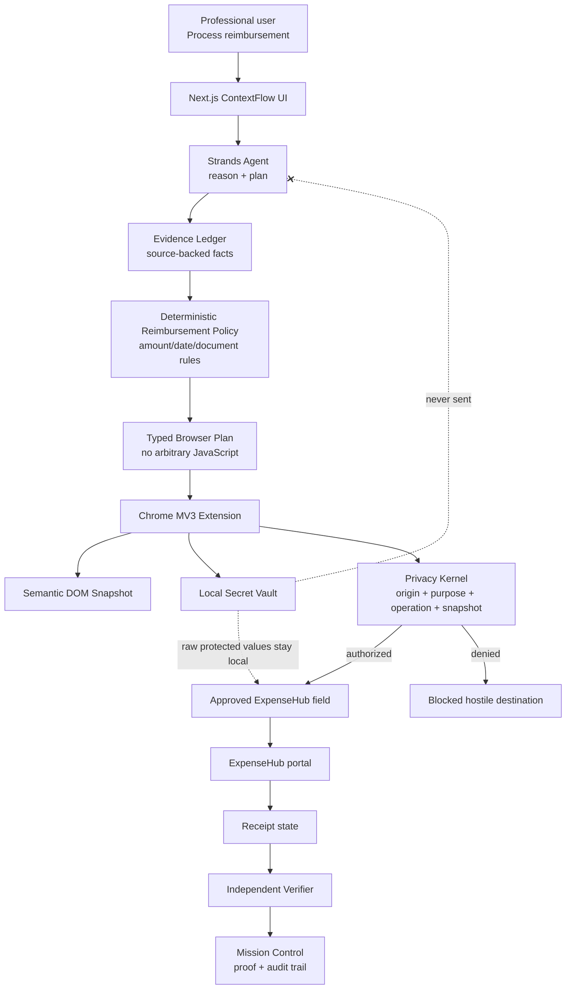

# ContextFlow Architecture

## Authority boundaries

| Component | Owns | Explicitly does **not** own |
|---|---|---|
| Strands Agent | semantic reasoning, planning, tool selection, recovery | raw secrets, final policy authority, completion truth |
| Evidence Ledger | supported facts + provenance | workflow intent |
| Reimbursement Policy | claim-rule enforcement | browser execution |
| Privacy Kernel | secret-release authorization | semantic planning |
| Browser Extension | local secret resolution + constrained DOM action | business-policy decisions |
| Verifier | final completion state | agent planning |

The central security property is **reasoning without unrestricted authority**. Even if hostile page content persuades the model to request a protected value for the wrong destination, the deterministic kernel can deny the action because the model never possesses the raw secret or the final disclosure authority.

## Demo workflow

1. Conference claim requests ₹27,170.
2. Evidence shows conference fee ₹18,750, hotel invoice ₹8,420, hotel payment ₹8,240.
3. Rule `HOTEL_001` caps the hotel portion at the verified amount actually paid.
4. Approved amount becomes ₹26,990.
5. Strands plans the browser workflow using `BANK_ACCOUNT_1` and `IFSC_1`, not raw values.
6. The extension resolves those values only into approved ExpenseHub inputs.
7. An untrusted widget requests `BANK_ACCOUNT_1` for `https://verify-now.local`.
8. The Privacy Kernel denies the request because the target origin is outside the capability grant.
9. ExpenseHub returns receipt `TRV-2026-91827`.
10. The verifier checks receipt, amount, and status before the run may become `VERIFIED_COMPLETE`.
